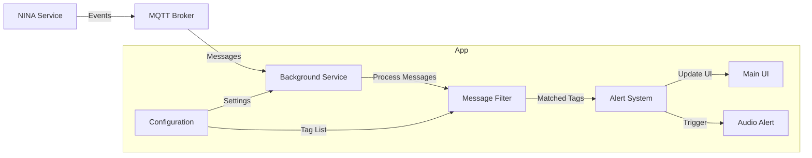

# N.A.P. (Nina Alert Application)

A Flutter application that monitors MQTT messages for specific alerts and displays them in a user interface. The app includes background service capabilities and audio notifications.

## Key Features

- 🔔 MQTT message monitoring
- 🔄 Background service support
- ⚡ Real-time alerts display
- 🔊 Audio notifications
- ⚙️ Configurable settings
- 📱 Cross-platform support (iOS and Android)

## Architecture

### Main Components

#### 1. Main App (`lib/main.dart`)
The main application consists of two primary views managed through a TabController:
- Errors Tab: Displays alerts and notifications
- Configuration Tab: Contains MQTT connection settings

Key classes:
- `MyApp`: Root widget
- `MyItem`: Configuration item model
- `Error`: Alert/error model
- `_MyAppState`: Main app state management

#### 2. Background Service (`lib/background.dart`)
Handles MQTT connections and message processing in the background:
- MQTT client initialization
- Message subscription and processing
- Audio alert management
- Communication with main UI

## Configuration Settings

The app allows configuration of:
1. IP Address (default: test.mosquitto.org)
2. Port (default: 1883)
3. Topic (default: test)
4. Tags (comma-separated values for alert filtering)

## Data Flow


## Team
- Filippo Gammaidoni
- Elena Bezzi
- Francesco Billa
- Daniele Beltrami
- Fabio Sterchevici
- Pietro Tironzelli
- Francesco Grelli

### Roles
- **Project Management**: Francesco Grelli
- **Main App Design & Implementation**: Filippo, Elena, Francesco Billa
- **Background Service Design & Implementation**: Fabio, Pietro, Francesco Grelli
- **Testing & Debugging**: Daniele Beltrami

## Setup

### Prerequisites
- Flutter SDK installed
- Mosquitto MQTT Broker
- NINA Service (for alert simulation)

### 1. Local MQTT Broker Setup

1. Install Mosquitto:
```bash
# Ubuntu/Debian
sudo apt-get install mosquitto mosquitto-clients

# macOS
brew install mosquitto

# Windows
# Download installer from https://mosquitto.org/download/
```

2. Configure Mosquitto for local network:
Create or edit `/etc/mosquitto/mosquitto.conf`:
```conf
listener 1883
allow_anonymous true
```

3. Start Mosquitto service:
```bash
# Linux/macOS
sudo systemctl start mosquitto
# or
mosquitto -v

# Windows
net start mosquitto
```

### 2. NINA Service Setup (Local Testing)

1. Install Nina
2. Run Nina
3. Configure Nina to use the local MQTT broker
4. Add Breakpoints in the nina planning 
5. Run Nina.

### 3. App Configuration

1. Launch the N.A.P. application
2. Go to the Configuration tab
3. Enter the following settings:
   - IP Address: `localhost` (or your local machine's IP)
   - Port: `1883`
   - Topic: `nina/alerts`
   - Tags: Add relevant alert tags (e.g., "emergency,warning,alert")

### 4. Testing the Setup

1. Verify MQTT connection:
```bash
# Subscribe to the topic in terminal
mosquitto_sub -h localhost -t nina/alerts

# Publish test message
mosquitto_pub -h localhost -t nina/alerts -m '{"type":"emergency","message":"Test Alert"}'
```

2. The app should now:
   - Connect to your local MQTT broker
   - Receive messages from the NINA simulator
   - Display alerts based on your configured tags

### Troubleshooting

1. MQTT Connection Issues:
   - Verify Mosquitto is running: `systemctl status mosquitto`
   - Check firewall settings for port 1883
   - Ensure correct IP/hostname in app configuration

2. Missing Alerts:
   - Verify topic matches between app and NINA simulator
   - Check if tags match the incoming messages
   - Monitor MQTT traffic: `mosquitto_sub -h localhost -t '#' -v`

## Testing

### Test Levels

#### 1. Unit Testing
- MQTT Client Connection Tests
  - Connection establishment
  - Message publishing/subscribing
  - Connection error handling
- Message Filter Tests
  - Tag matching algorithms
  - Message parsing
  - Alert generation logic

#### 2. Integration Testing
- Background Service Integration
  - Service initialization
  - Communication with main UI
  - Message processing pipeline
- Audio System Integration
  - Alert sound triggering
  - Sound file loading
  - Volume control

#### 3. UI Testing
- Tab Navigation
  - Switch between Error and Configuration tabs
  - State preservation
- Configuration Interface
  - Input validation
  - Settings persistence
  - Real-time updates
- Alert Display
  - Message rendering
  - Scroll behavior
  - Alert prioritization

### Test Environment Setup

1. Mock MQTT Broker
```bash
# Using Mosquitto test broker
mosquitto -v -p 1883
```

2. Test Data Generator
```bash
# Python script for generating test messages
python test_message_generator.py --frequency 0.5 --tags "emergency,warning"
```

### Test Scenarios

#### Critical Path Testing
1. Alert Reception
   - Send test message
   - Verify background processing
   - Check UI update
   - Validate audio alert

2. Configuration Changes
   - Modify MQTT settings
   - Verify reconnection
   - Confirm new message routing

#### Error Handling
- Network disconnection
- Invalid message format
- Missing configuration
- Background service crashes
